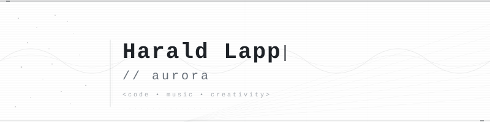
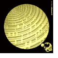

<picture width="100%">
  <source media="(prefers-color-scheme: dark)" srcset="assets/header-dark.svg">
  <source media="(prefers-color-scheme: light)" srcset="assets/header-light.svg">
  
</picture>

[demoscene](https://en.wikipedia.org/wiki/Demoscene) musician & coder •  90s • aurora ^ e-nergetic / devotion / skyjump-team

### code & tech

<code>C#</code> • <code>F#</code> • <code>Bash</code> • <code>JavaScript</code> • <code>PHP</code> • <code>Lua</code> 
<code>.NET</code> • <code>ASP.NET Core</code> • <code>Blazor</code> 
<code>LLMs</code> • <code>Semantic Kernel</code> 
<code>Linux</code> • <code>UNIX</code> • <code>macOS</code> • <code>Docker</code> • <code>Kubernetes</code> 
<code>Distributed Systems</code> • <code>Event Sourcing</code> 

### from BASIC to F#

&nbsp;&nbsp;&nbsp;&nbsp;&nbsp;BASIC → ASM → Turbo Pascal → Perl → PHP/JavaScript → C# → F#

### projects

&nbsp;&nbsp;&nbsp;&nbsp;&nbsp;[github.com/aurora](github.com/aurora) &ndash; open source 
&nbsp;&nbsp;&nbsp;&nbsp;&nbsp;[github.com/aurora-php](github.com/aurora-php) &ndash; archived PHP projects 

### music

<b>AUTRAX • Réchauffé</b> <i>(2017, Carpe Sonum Records)</i> 
Electronic music inspired by ambient,
sequencer-driven electronica and the strange,
spacious sounds of 90s German electronic music. 
[autrax.de](https://www.autrax.de/) • [Bandcamp](https://carpesonum.bandcamp.com/album/r-chauff) • [Spotify](https://open.spotify.com/intl-de/album/2XXjYcT4PbKI2DReVrb15P?si=rYgB0uU7RliK3uISxKU0yA)

### vintage computing

&nbsp;&nbsp;&nbsp;&nbsp;&nbsp;TI-99/4A • SGI Indy • HP C8000 • [unixaddict.org](unixaddict.org)
